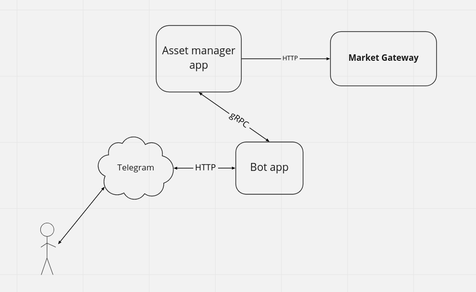

# homework-2

## Клиенты:
* Telegram (https://t.me/ot_stonks_bot)

## Запуск сервиса:
### В Docker:
Файлы конфигурации для запуска в docker окружении:
* config/bot_docker.yml
* config/portfolio_docker.yml

Запуск сервиса через docker-compose:
```bash
    make build
    make run
```

## Чат-бот для мониторинга портфеля ценных бумаг

## Функциональные требования:
1. Пользователь регистрируется в системе через активацию чат-бота в мессенджере.
2. Пользователю доступны три пункта меню: портфели, уведомления и дашборд.
3. Пользователь может создать портфели финансовых инструментов (именованные списки securities). Каждый портфель содержит список позиций ценных бумаг. Одна позиция - код ценной бумаги + количество.\
Пользователь может добавлять новые позиции в портфель и удалять целые позиции из портфеля.\
Приложение может отклонить добавление позиции, если информация о ней не найдена на бирже.
4. Пользователь может задать уровень цены (пороговое значение) для ценной бумаги, при достижении которой пользователь получит уведомление.
5. Пользователь может просмотреть дашборд по созданным портфелям.\
Дашборд - сообщение с информацией по текущему объему (стоимости) всех портфелей + информация об изменении стоимости за прошлый день и за время с даты создания портфеля.

## Компоненты сервиса
1. **Asset manager app**\
Приложение для хранения информации о пользовательских портфелях и порогах, вычисления стоимости портфелей. \
Собирает информацию об изменениях цен используемых ценных бумаг через API moex (или парсим invest.com). Производит уведомление пользователя через мессенджер.
2. **Bot app**\
Приложение для получения и отправки сообщений в мессенджеры. Получение команд из мессенджера через long polling. Хранит состояние диалога с пользователем.




MVP:
1. Юзер может завести и удалить портфель активов
2. Не храним историю изменения стоимости, показываем только текущую
3. Периодически обновляем текущую стоимость всех портфелей

План-максимум:
4. Храним и показывам историю изменений стоимости портфеля за периоды
5. Уведомления для пользователя по ценам ЦБ
6. Подсказки для пользователя при добавлении инструментов в портфель: поиск ЦБ по префиксу кода, отображение информации о ЦБ
