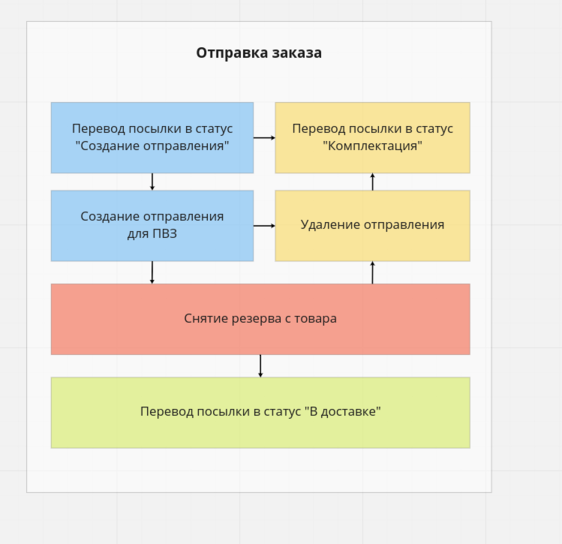

# homework-3

https://overload.yandex.net/530754

**Ссылка на схему в Miro:**\
https://miro.com/app/board/uXjVO4wx-Sc=/

## Описание функционала Ozon:
**Продавец:**
1. Может загрузить товар с описанием
2. Может выставить цену товара и количество на складе
3. Может сделать акцию
4. Может снять товар с продажи
5. Получает уведомления о заказах
6. Может отправить товары со своего склада в ПВЗ
7. Может посмотреть аналитику: продажи, возвраты, просмотры
8. Может создать кампанию по продвижению в поисковой выдаче

**Покупатель:**
1. Может пользоваться поиском товаров по названию, категориям
2. Получает рекомендации товаров
3. Может создать, оплатить, отменить заказ
4. Получает уведомления о статусах заказов
5. Может оставить отзыв о товаре
6. Получает бонусные баллы за заказы
7. Может оплатить часть заказа бонусами
8. Может выбрать способ доставки заказа
9. Может оформить возврат товара

**ПВЗ / Курьер:**
1. Принимает отправления
2. Выдает отправления покупателям
3. Оформляет возвраты

## Транзакция отправки заказа
1. Сервис заказов переводит заказ в статус "Оплачен"
2. В сервисе отправлений все отправления заказа переводятся в статус "Комплектация"
3. Продавец получает уведомление об изменении статуса отправления
4. В сервисе предложений снимается резерв товара\
.............
5. При передаче в службу доставки отправлению присваивается статус "Передано в доставку"
6. Покупатель получает уведомление о передаче части заказа в доставку

# Сага отправки посылки
**Схема:**\

**Описание саги:**
1. Продавец создает заявку на отправку (delivery) посылки (shipment service)
2. В сервисе ПВЗ создается запись об отгрузке (post service)
3. В сервисе предложений снимается резерв товара (offer service)
4. Обновляется статус посылки на Передано в доставку (shipment service)

**Топики:**
- new_shipment_delivery
- commit_delivery
- cancel_delivery
- remove_reserve
- new_post_delivery

## Требования сервисов
### Сервис предложений товаров

**Функциональные требования:**
1. Хранит цену товара без акции и минимальную цену товара
2. Хранит остатки товара на складе
3. Может резервировать необходимое количество товара и снимать резерв

**Исходные данные:**\
500к заказов в сутки сейчас, рост на 20% в год ~ 2 млн. заказов в сутки через 5 лет\
100 млн. товаров, 250 млн. через 5 лет

**Нагрузка:**
1. 2 млн. заказов в сутки * 1.5 различных товаров в заказе = 3млн. запросов цены товара в сутки ~ 34 Read RPC
2. 3 млн. * 2 = запросов на резерв товара + снятие резерва ~ 70 Write RPC
3. 5 млн. активных юзеров * 15 поисковых запросов в сутки = 75 млн запросов цены товаров в сутки ~ 800 Read RPC
4. 20 млн. юзеров * 50 поисковых запросов в месяц = 1 млрд запросов в месяц  = 350 млн. запросов в сутки ~  4k Read RPC
5. Обновление цены 20 млн товаров (20%) раз в неделю = 3 млн запросов в сутки
   Обновление цены 80 млн товаров (80%) раз в месяц = 3 млн. запросов в сутки
   6 млн. обновлений цены в сутки ~ 70 Write RPC

**Итого:** ~ 5k Read RPC и 150 Write RPC

**Хранилище:**
1. 250 млн. товаров через 5 лет
2. Запись 1 предложения:
   { offerId: string, sellerId: long, productId: long, price: double, minPrice: double, stock: long, reserved: long } ~ 64 байт + PG overhead (24 байт) ~ 100 байт
   Итого: таблица предложений ~ 25 Gb + индексы 5 Gb + replica + backup

**RAM:** 2 Gb PG + 5 Gb (20% данных) Memcache

**API:**
1. CreateOffer(productId, sellerId, offerId)
2. UpdatePrice(productId, price, minPrice)
3. UpdateStock(productId, newStock)
4. GetPrice(productId)
5. UpdateReverve(productId, reserve)

### Сервис заказов

**Функциональные требования:**
1. Хранит список всех заказов
2. Хранит статус заказа (Создан, оплачен, завершен, отменен)
3. Отсылает уведомления по изменению статуса заказа
4. При отмене заказа, отменяет все отправления
5. При оплате заказа, переводит отправления на этап комплектации

**Нагрузка:**
1. 500к заказов в сутки, 2 млн через 5 лет = ~ 20 Write RPC
2. 2 млн заказов * 2 обновления статуса в сутки ~ 20 Write RPC
3. 2 млн * 5 просмотров в сутки ~ 100 Read RPC

**Итого:** ~ 100 Read RPC и 40 Write RPC

**Хранилище:**
1. 500к заказов в сутки = 180млн в год, за 5 лет при росте 30%/год = ~ 1.2 млрд заказов за 5 лет
2. Структура 1 заказа:\
Products: `[{selledId: long, productId: long, price: double, quantity: long}]` ~ 64 byte / record\
Shipments: `[{shipmentId: long}]` ~ 40 byte / record\
Order: `{id: long, orderId: string (~20 bytes), customerId: long,  products: Products, shipments: Shipments, status: integer, orderTime: long}` ~ 200 bytes

1.2 млрд заказов * 200 bytes =~ 250Gb таблицы + 30Gb индексы\
Шардинг таблицы по заказчикам, партиционирование по статусу

**Итого:** ~ 300Gb PG database + replica + backup

**API:**
1. NewOrder(customerId, products, shipmets, orderTime)
2. GetOrders(customerId)
3. GetOrder(orderId)
4. UpdateStatus(orderId, newStatus)

### Сервис отправлений

**Функциональные требования:** 
1. Хранит все отправления товаров со складов
2. Хранит статус отправления (Создано, Комплектация, Передано в доставку, Передано в ПВЗ, Выдано)
3. Отправляет уведомления продавцу и покупателю при изменении статуса отправления

**Исходные данные:**\
2 млн. заказов в сутки через 5 лет * 1.15 разных продавцов в заказе = 2.3 млн. отправлений в сутки

**Нагрузка:**
1. Создание 2.3 млн. отправлений в сутки =~ 25 Write RPC
2. Обновление статуса отправления 2.3 млн * 4 статуса =~ 120 Write RPC
3. Получение статуса отправления 2.3 млн * 5 просмотров в сутки = 150 Read RPC

**Итого:** 150 Read RPC и 150 Write RPC

**Хранилище:**
1. 1.2 млрд заказов через 5 лет * 1.15 разных продавцов в заказе = 1.4 млрд отправлений через 5 лет
2. Структура отправления:
   { shipmentId: long, orderId: string (20 bytes), sellerId: long, sourceStorageId: long, destId: long, destType: integer, status: integer, createdTime: long, finishTime: long } ~ 80 байт + PG overhead (24 байт) ~ 110 байт
   Итого: таблица отправлений ~ 150 Gb + индексы 20 Gb

**API:**
1. CreateShipment(orderId, sellerId, souceStorage, destType, destId)
2. UpdateShipmentStatus(shipmentId, newStatus)
3. GetShipmentInfo(shipmentId)
